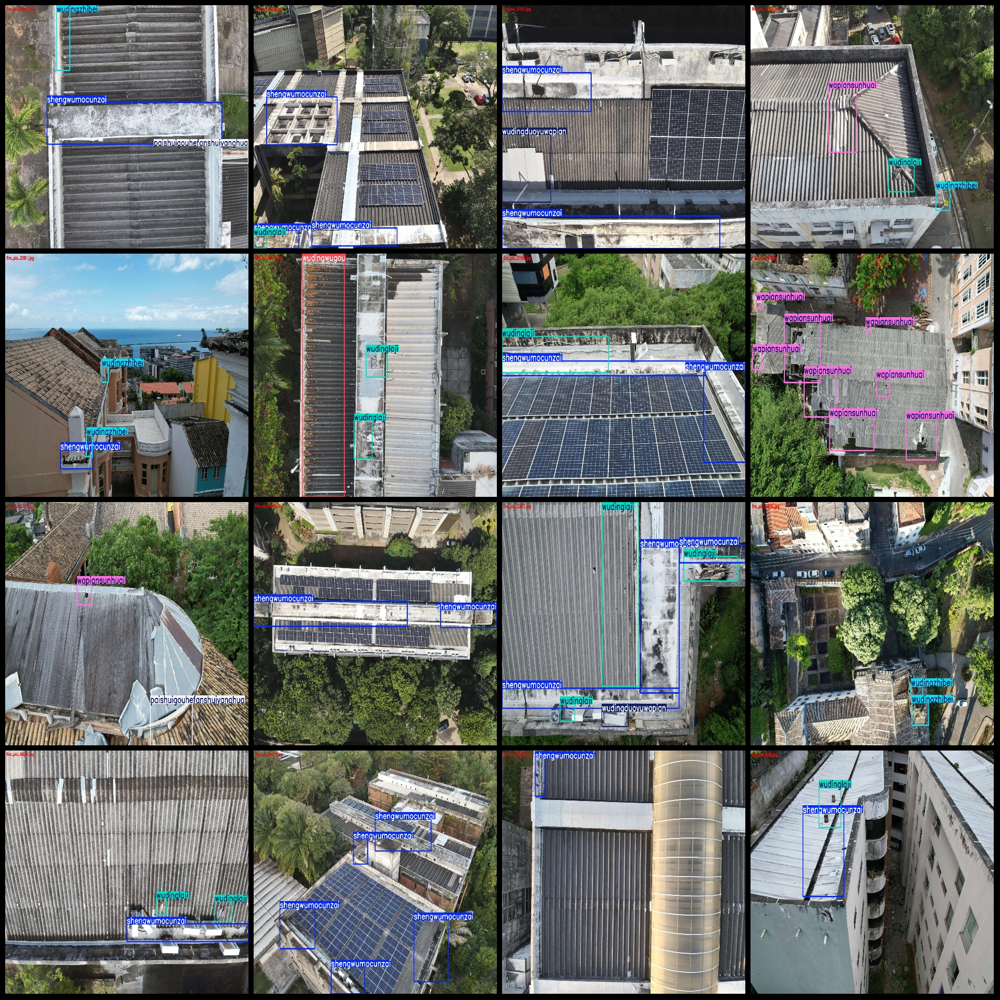
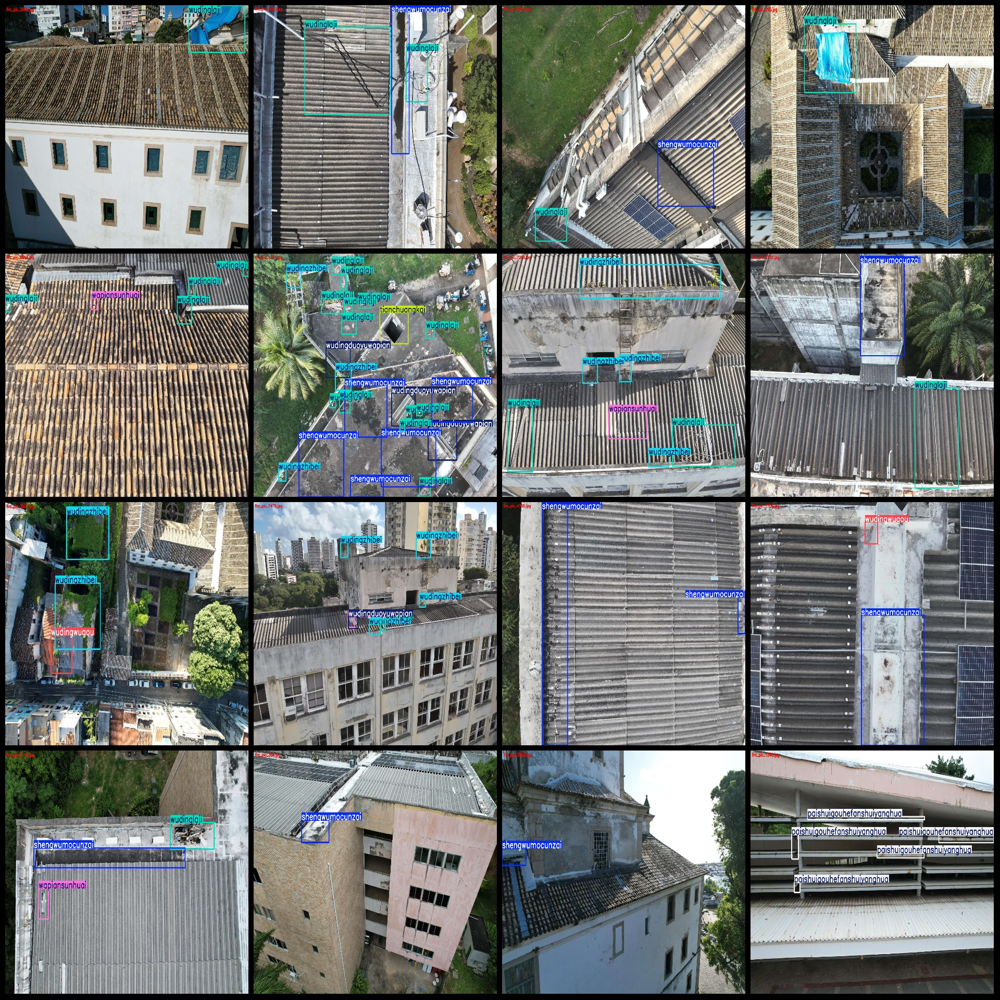

# Drone-Viewpoint Aerial Photos, High-Definition Roof Inspection with Damaged Tiles and Grass Growth Dataset VOC+YOLO Format - 7975 Images in 10 Categories

Dataset format: Pascal VOC format + YOLO format (txt files without split paths, only containing jpg images and corresponding VOC format xml files and yolo format txt files)
Number of images (jpg file count): 7975
Number of annotations (xml file count): 7975
Number of annotations (txt file count): 7975
Number of categories: 10
Annotation category names: ["banpiliefeng", "paishuigouhefanshuiyanghua", "shengwumocunzai", "tianchuangkai", "wapiansunhuai", "wapianyiwei", "wudingduoyuwapian", "wudinglaji", "wudingwugou", "wudingzhibei"]
[Category Names] : ["Plate Crack", "Drain Gutter and Water Oxidation", "Biofilm Presence", "Window Open", "Tile Damage", "Tile Relocation", "Excessive Tiles on Roof", "Roof Garbage", "Roof Dust", "Roof Moss"]
Each category annotation box count:
banpiliefeng box count = 604
paishuigouhefanshuiyanghua box count = 279
shengwumocunzai box count = 9552
tianchuangkai box count = 389
wapiansunhuai box count = 2093
wapianyiwei box count = 305
wudingduoyuwapian box count = 1536
Frame count = 9905
Frame count = 1830
Frame count = 4402
Total frames: 30895
Images per category:
Banpilefirefeng: 292
Paishuigouhefanshuiyanghua: 205
Shengwumocunzai: 4961
Tianchuangkai: 268
Wapiansunhuai: 1148
Wapianyiwei: 270
Wudingduoyuwapian: 1040
Wudinglaji: 4111
Wudingwugou: 1192
Wudingzhibei: 2075
Image resolution: 1920x1440
Use labelImg tool:
Markup Rule: Draw a rectangle around the category.
Important note: The dataset does not have split into training, validation, and test sets.
Special Disclaimer: This dataset does not guarantee the accuracy of the trained models or weight files.
Preview of the image:
## Images

Here is a pay link on Stripe ( https://buy.stripe.com/3cs8yP7sY87d0vu9AB ). Please contact me lonlonago@foxmail.com after funding $89, and I will send you a complete data files , thank you!

